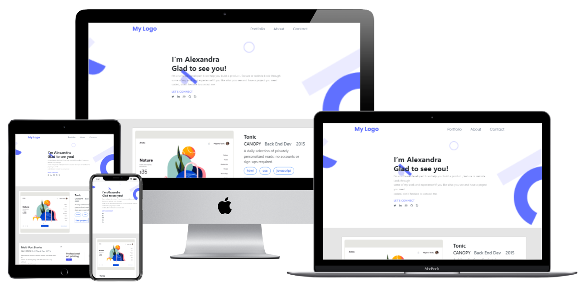

# The Portfolio using Bootstrap v5

> This is our implementation of a portfolio template on Figma using Boostrap v5. This is solely focused on using Bootstrap to create the desktop version. 

## Built With

- HTML5
- CSS3
- Git
- Bootstrap v5

## Live Demo

[Live Demo Link](https://raw.githack.com/chelmerrox/portfolio-bootstrap/bootstrap/index.html)

## Preview



## Getting Started

To get a local copy up and running follow these simple example steps.

### Prerequisites

- HTML5 & CSS3 
- VSCode (or any other text editor)
- Git
- GitHub
- Command line/Terminal

### Setup

From the command line, do the following steps below:

1. Clone the projects' repository into your machine.

```bash
# Clone this repository
$ git clone git@github.com:chelmerrox/portfolio-bootstrap.git

```
2. Change directory/Go into the repository with the command below.

```bash
$ cd portfolio-bootstrap

```

## Authors

👤 **Losalini Rokocakau**

- GitHub: [@chelmerrox](https://github.com/chelmerrox)
- Twitter: [@chelmerrox](https://twitter.com/chelmerrox)
- LinkedIn: [Losalini Rokocakau](https://linkedin.com/in/losalini-rokocakau)

👤 **Edith Naisanga**

- GitHub: [@nedith](https://github.com/nedith)

👤 **Faranosh Amini**

- GitHub: [@FaranoshAmini](https://github.com/FaranoshAmini)

## 🤝 Contributing

Contributions, issues, and feature requests are welcome!

Feel free to check the [issues page](https://github.com/chelmerrox/portfolio-bootstrap/issues).

## Show your support

Give a ⭐️ if you like this project!

## Acknowledgments

- Microverse
- Coding & Learning Partners: 
  1. Edith Naisanga
  2. Faranosh Amini
- Morning Session Teams
- Stand-Up Teams
- Microverse TSEs
- Figma 

## 📝 License

This project is [MIT](./MIT.md) licensed.